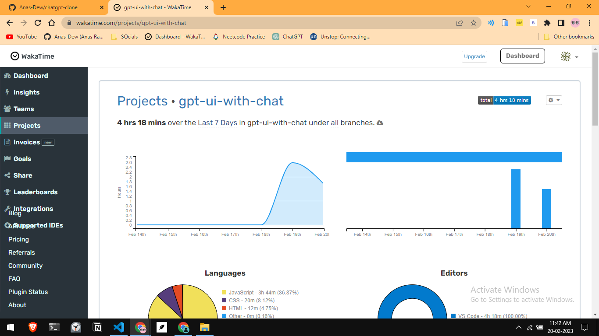

# ChatGPT Clone - CloneGPT

🔊 This project's development is officially stopped. However's is still open source and you can fork and use it. And any contibution will be appreciated.
## At a glance
<video src="https://dews-files.s3.us-east-005.backblazeb2.com/dewchat.mp4" controls>
  Your browser does not support the video playback.
</video>

> I made this project in 4 hours and 18 minutes.

It's quiet fun and crazy. And I integrated Open AI with it so you can ask anything.

Use it here : [CloneGPT](https://chat.anasdew.tech/)

